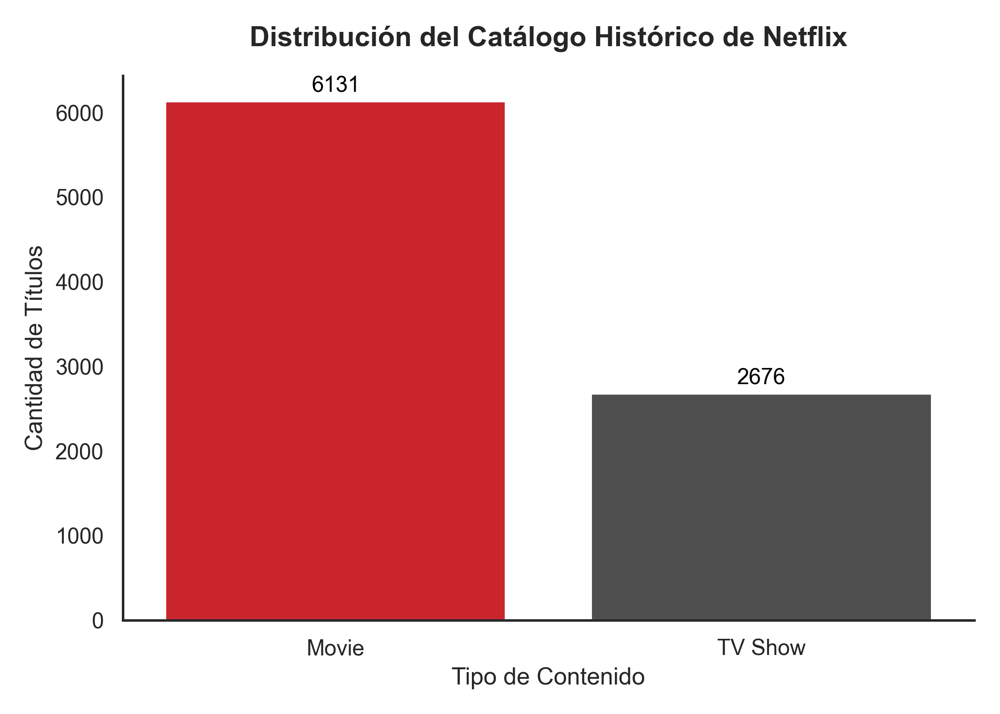
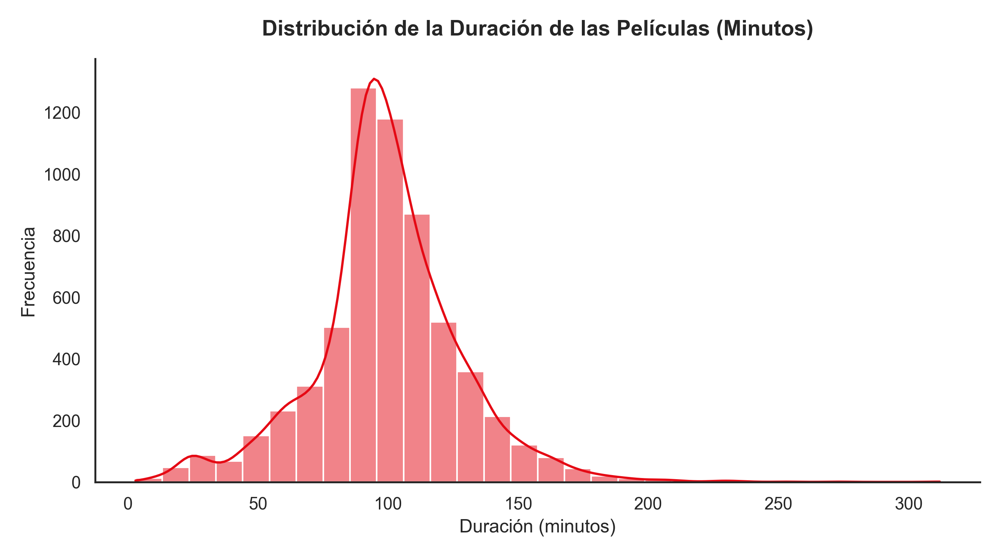
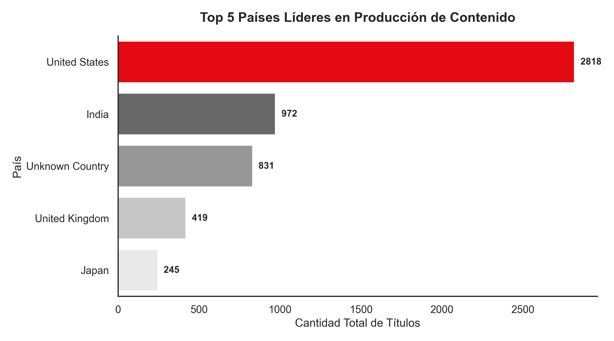
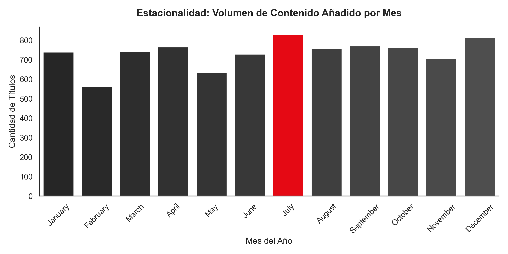
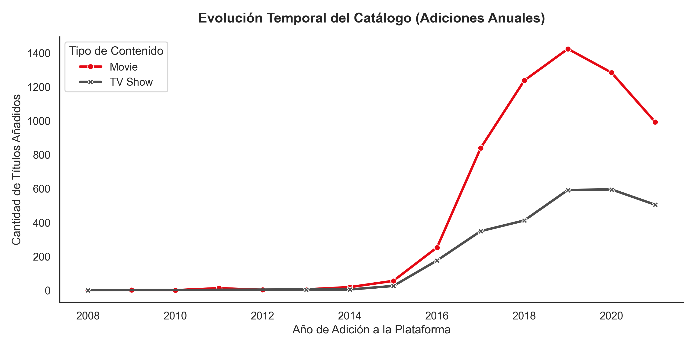

# 🎬 Análisis Exploratorio de Datos del Catálogo de Netflix - Proyecto Evolve

##  1. Objetivo del Proyecto
Este proyecto tiene como propósito diseñar e implementar un **pipeline estructurado de Ciencia de Datos (raw → clean → features → viz)** para interrogar y analizar el catálogo histórico de títulos de Netflix. A través de este proceso modular, se busca identificar patrones estratégicos de la plataforma, tales como su enfoque de distribución de contenidos, las características de duración de sus producciones, la concentración geográfica de sus mercados y la evolución temporal de su catálogo para comprender las dinámicas de retención de usuarios.

---

##  2. Arquitectura y Estructura del Proyecto
'''El proyecto sigue principios de diseño de ingeniería de software mediante una estructura modular, limpia y reproducible. Se ha incorporado una carpeta dedicada a almacenar las imágenes de los gráficos exportados:

```text
Netflix---proyecto-Evolve/
├── data/
│   ├── raw/          <- Archivo original "netflix_titles.csv" (datos en sucio)
│   └── clean/        <- Dataset procesado y enriquecido listo para análisis
├── notebooks/
│   └── eda.ipynb     <- Notebook principal con la narrativa paso a paso del EDA
├── reports/
│   └── visualizaciones/ <-- CARPETA CON LAS GRÁFICAS EXPORTADAS (.png)
│       ├── 1_tipo_contenido.png
│       ├── 2_distribucion_duracion.png
│       ├── 3_top_paises.png
│       ├── 4_estacionalidad_meses.png
│       └── 5_evolucion_temporal.png
├── src/
│   ├── __init__.py   <- Archivo de inicialización del módulo de Python
│   ├── config.py     <- Centralización de rutas absolutas y relativas del sistema
│   ├── io.py         <- Módulo encargado del input/output (carga segura de archivos)
│   ├── cleaning.py   <- Módulo de transformación, imputación de nulos y feature engineering
│   └── viz.py        <- Módulo con las funciones de visualización avanzadas
└── README.md         <- Documento de presentación del proyecto (este archivo)
```


##  3. Proceso de Limpieza y Transformación (src/cleaning.py)

Para garantizar un análisis riguroso sin destruir datos valiosos (mitigando pérdidas por eliminación masiva), se aplicaron las siguientes estrategias:

Imputación de Nulos en Texto: Las columnas director, cast y country presentaban altas tasas de valores vacíos; fueron rellenadas de forma genérica con la etiqueta 'Unknown' para mantener la integridad de las filas.

Imputación de Ratings: Los registros nulos de la columna rating fueron corregidos estadísticamente utilizando la moda (el valor más común).

Conversión y Feature Engineering Temporal: La columna date_added se parseó a formato datetime. A partir de ella se derivaron de forma analítica dos nuevas variables: year_added (año de adición) y month_added (mes de adición) para desbloquear estudios de estacionalidad.

Tratamiento de Magnitudes Continuas (Duración): Se procesó la columna duration mediante expresiones regulares para extraer exclusivamente el número entero en duration_num, permitiendo operaciones aritméticas y distribuciones estadísticas (separándolo de su unidad física "min" o "Seasons").

Deduplicación: Se ejecutó una limpieza de registros duplicados idénticos en el dataset.

##  4. Preguntas de Investigación y Visualizaciones Modulares

El módulo `src/viz.py` implementa el control gráfico controlando el ruido visual (*Data-Ink Ratio*), eliminando los bordes superior y derecho (`sns.despine()`) e incorporando una paleta institucional basada en el rojo Netflix (`#E50914`) y grises neutros (`#4E4E4E`).

###  Pregunta 1: ¿El catálogo está dominado por películas o series?
* **Función:** `plot_content_type(df)`
* **Tipo de Gráfico:** Gráfico de frecuencias / Conteo vertical (`sns.countplot`).
* **Variables involucradas:** `type` (Movie vs. TV Show).
* **Explicación:** Evalúa la proporción total de formatos en la historia de la plataforma. Muestra de forma transparente las etiquetas numéricas superiores en cada barra para agilizar la lectura de frecuencias absolutas.



---

###  Pregunta 2: ¿Cuál es la duración promedio de las películas y cómo se distribuye?
* **Función:** `plot_movie_duration(df)`
* **Tipo de Gráfico:** Histograma continuo enriquecido con estimación de densidad de kernel (KDE).
* **Variables involucradas:** `duration_num` (filtrando por `type == 'Movie'`).
* **Explicación:** Filtra exclusivamente largometrajes cinematográficos para estudiar la morfología de la duración en minutos, permitiendo comprobar si el contenido responde a los estándares comerciales del cine de duración estándar o si presenta asimetrías.



---

###  Pregunta 3: ¿Cuáles son los 5 países líderes en producción?
* **Función:** `plot_top_countries(df)`
* **Tipo de Gráfico:** Barras de frecuencias horizontales (`sns.barplot`).
* **Variables involucradas:** `country`.
* **Explicación:** Excluye las etiquetas desconocidas para graficar los 5 polos geográficos dominantes. El eje horizontal facilita la lectura natural de los nombres de los países y los valores absolutos se anexan al final de cada barra.



---

###  Pregunta 4: ¿Existe estacionalidad mensual en el lanzamiento de contenidos?
* **Función:** `plot_seasonality(df)`
* **Tipo de Gráfico:** Gráfico de barras ordenado cronológicamente (Enero-Diciembre).
* **Variables involucradas:** `month_added`.
* **Explicación:** Organiza cronológicamente el volumen de lanzamientos para identificar si la empresa concentra sus estrenos en épocas vacacionales o cierres de año fiscales. Aplica un realce de color condicional, pintando de rojo únicamente la barra con el valor máximo para guiar el ojo del analista.



---

###  Pregunta 5: ¿Cómo ha evolucionado la estrategia de contenidos en el tiempo?
* **Función:** `plot_evolution(df)`
* **Tipo de Gráfico:** Gráfico de líneas multivariante con marcadores temporales (`sns.lineplot`).
* **Variables involucradas:** `year_added`, `type`.
* **Explicación:** Rastrea las adiciones anuales desde 2008 hasta el último periodo del registro, contrastando de manera paralela las trayectorias de películas frente a series para documentar transformaciones en el modelo de negocio.

